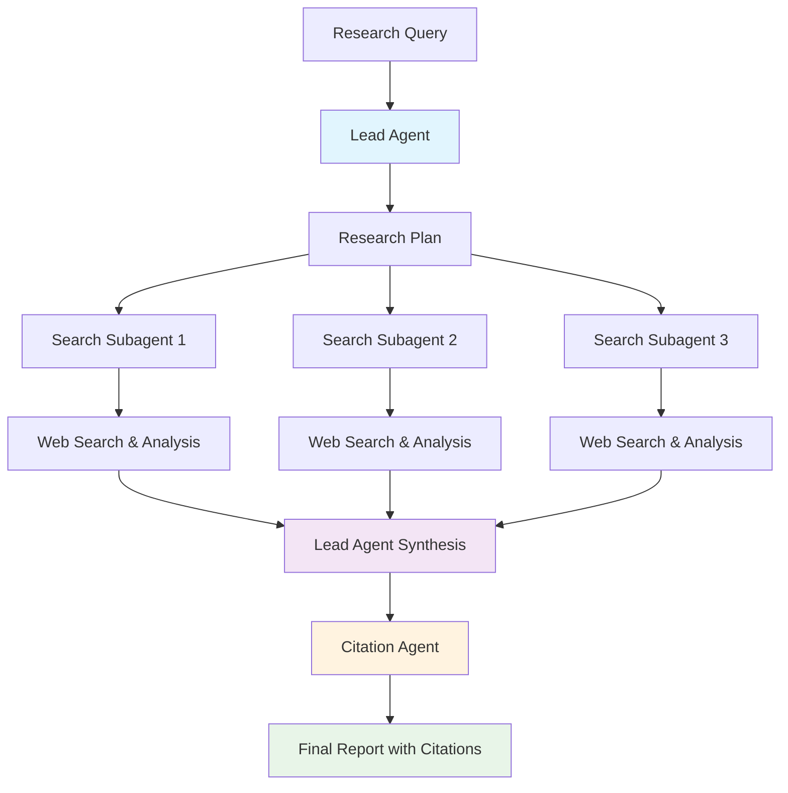

# Make It Heavy - TypeScript Multi-Agent AI Research System

A powerful TypeScript implementation of an advanced multi-agent AI research orchestrator with Lead Agent coordination, specialized search subagents, automatic citations, and comprehensive logging capabilities.

## 🚀 Features

- **🤖 Single Agent Mode**: Fast, direct AI interactions for simple queries
- **🔬 Enhanced Multi-Agent Research Orchestrator**: Advanced research system with Lead Agent coordination, specialized search subagents, automatic citations, and comprehensive logging
- **🔧 Tool System**: Extensible tool ecosystem with calculator, search, and file operations
- **⚡ TypeScript**: Full type safety and modern ES modules
- **🎯 OpenRouter Support**: Compatible with multiple AI models via OpenRouter
- **🔄 Parallel Processing**: Efficient concurrent agent execution
- **📊 Rich CLI Interface**: Interactive prompts with helpful commands

## 🎯 Quick Start for Code Translation Tasks

**🚨 Having trouble with multiline input?** Run the setup script first:

```bash
./setup-input.sh
```

This fixes the common UX issue where only the first line of code gets captured. Choose:
- **Editor Mode** (recommended): Opens VS Code/editor for pasting code blocks
- **Terminal Mode** (improved): Paste in terminal, press Enter twice to finish  
- **Single Line Mode**: For quick one-line questions

## 📦 Installation

### 1. Clone and Setup
```bash
git clone <repository-url>
cd make-it-heavy-ts
npm install
```

### 2. Install Dependencies
```bash
# Install all required packages
npm install @langchain/core @langchain/openai @langchain/community @ai-sdk/openai ai js-yaml cheerio axios mathjs enquirer zod ioredis

# Install development dependencies
npm install --save-dev typescript ts-node @types/node @types/js-yaml @types/ioredis
```

### 3. Setup Redis (Required for Enhanced Multi-Agent Mode)

The enhanced orchestrator requires Redis for memory persistence and session management:

**Option 1: Docker (Recommended)**
```bash
docker run -d --name redis-make-it-heavy -p 6379:6379 redis:alpine
```

**Option 2: Local Installation**
```bash
# Ubuntu/Debian
sudo apt update && sudo apt install redis-server
sudo systemctl start redis-server

# macOS
brew install redis
brew services start redis

# Windows
# Download and install from https://redis.io/download
```

**Test Redis Connection:**
```bash
redis-cli ping  # Should return "PONG"
```

### 4. Configuration

Edit `config.yaml` with your API credentials:

```yaml
openrouter:
  api_key: "your-openrouter-api-key-here"  # Get from https://openrouter.ai
  base_url: "https://openrouter.ai/api/v1"
  model: "anthropic/claude-3.5-sonnet:beta"

agent:
  max_iterations: 10
  max_execution_time: 300
  temperature: 0.7

orchestrator:
  max_agents: 5
  synthesis_model: "anthropic/claude-3.5-sonnet:beta"

redis:
  url: "redis://localhost:6379"  # Redis server for memory persistence
  ttl: 3600                      # Session TTL in seconds (1 hour)
```

## 🎯 Usage

### Single Agent Mode
For quick questions and simple tasks:
```bash
npm run dev
```

Example interactions:
- "What's the square root of 144?"
- "Search for the latest TypeScript features"
- "Read the contents of package.json"

### Enhanced Multi-Agent Research Orchestrator
For complex queries requiring comprehensive research with citations:
```bash
npm run dev:heavy
```

**Features:**
- **Lead Agent Coordination**: Intelligent research planning and task breakdown
- **Parallel Search Subagents**: Specialized agents for targeted web research
- **Automatic Citations**: Inline references and bibliography generation
- **Adaptive Configuration**: Resource allocation based on query complexity
- **Comprehensive Logging**: Detailed tracking of every research step
- **Memory Persistence**: Session management and progress tracking

Example research queries:
- "Compare Python, TypeScript, and Rust for web API development with performance metrics and use cases"
- "Analyze renewable energy trends, market opportunities, and investment strategies with current data"
- "Create a comprehensive machine learning study plan with resources, timeline, and project ideas"

**CLI Commands:**
- `help` - Show available commands
- `research` - Show research system help
- `status` - List all active research sessions
- `status <id>` - Check specific research status
- `result <id>` - Get completed research result
- `examples` - Show example complex queries
- `config` - Show current configuration

## 🔧 Available Tools

| Tool | Description | Example Usage |
|------|-------------|---------------|
| **Calculator** | Safe mathematical evaluation | "Calculate compound interest: (1000 * (1 + 0.05)^10)" |
| **Search** | Web search via DuckDuckGo | "Search for TypeScript best practices 2024" |
| **Read File** | Read local text files | "Read the contents of README.md" |
| **Write File** | Write to local text files | "Create a file called notes.txt with my ideas" |

## 🏗️ Architecture

```
make-it-heavy-ts/
├── types/                 # TypeScript interfaces
│   ├── config.ts         # Configuration types
│   ├── tool.ts           # Tool system types
│   └── schemas.ts        # Research system schemas
├── agents/               # Specialized agent system
│   ├── base.ts          # Base agent class
│   ├── lead.ts          # Lead Research Agent
│   ├── search.ts        # Search Subagent
│   └── citation.ts      # Citation Agent
├── utils/                # Utility functions
│   ├── config.ts        # Config loading
│   ├── memory.ts        # Redis memory store
│   ├── prompts.ts       # Agent-specific prompts
│   └── progress.ts      # Progress display
├── tools/                # Tool implementations
│   ├── calculator.ts    # Math operations
│   ├── search.ts        # Web search (enhanced)
│   ├── file.ts          # File operations
│   └── index.ts         # Tool registry
├── agent.ts              # Legacy agent (extends BaseAgent)
├── orchestrator.ts       # Enhanced research coordinator
├── main.ts               # Single-agent CLI
├── make_it_heavy.ts      # Enhanced multi-agent CLI
├── config.yaml           # Configuration
└── package.json          # Dependencies
```

## 🔄 How Enhanced Multi-Agent Research Works

The system uses a sophisticated multi-tier architecture for comprehensive research:

1. **🧠 Lead Agent Planning**: Creates detailed research plans with specialized subtasks
2. **🔍 Parallel Search Execution**: Multiple search subagents conduct targeted research
3. **📊 Quality Evaluation**: Results are scored and filtered for relevance and authority
4. **🔄 Iterative Research**: Follow-up tasks generated based on initial findings
5. **📝 Synthesis**: Lead agent integrates all findings into coherent reports
6. **📚 Citation Integration**: Citation agent adds inline references and bibliography

**Adaptive Configuration:**
- High complexity queries: 4 subagents, 3 iterations
- Medium complexity queries: 3 subagents, 2 iterations  
- Low complexity queries: 2 subagents, 1 iteration



## ⚙️ Development

### Build
```bash
npm run build
```

### Production
```bash
npm start          # Single-agent mode
npm start:heavy    # Multi-agent mode
```

### Development with Hot Reload
```bash
npm run dev        # Single-agent mode
npm run dev:heavy  # Multi-agent mode
```

## 🔧 Configuration Options

### CLI Input Settings
Configure how the CLI handles user input to solve issues with incomplete input or limited input areas:

```yaml
input:
  type: "text"                    # Input type: 'input', 'text', 'editor'
  max_length: 10000              # Maximum characters allowed
  multiline: true                # Enable multi-line input
  editor_command: "nano"         # Editor for 'editor' type
```

#### Input Types:
- **`input`** (default): Single-line input, suitable for short queries
- **`text`**: Multi-line input with Ctrl+D to finish, ideal for longer questions
- **`editor`**: Opens external editor (nano, vim, code, etc.) for complex inputs

#### Recommended Settings:
- For **short queries**: `type: "input"`, `multiline: false`
- For **longer questions**: `type: "text"`, `multiline: true`  
- For **very long inputs**: `type: "editor"`, `editor_command: "code"` (or your preferred editor)

### OpenRouter Models
Popular model options:
- `anthropic/claude-3.5-sonnet:beta` (Recommended)
- `openai/gpt-4-turbo`
- `google/gemini-pro-1.5`
- `meta-llama/llama-3.1-70b-instruct`

### Agent Settings
- `max_iterations`: Maximum tool-use loops (default: 10)
- `max_execution_time`: Timeout in seconds (default: 300)
- `temperature`: Response randomness 0-1 (default: 0.7)

### Orchestrator Settings
- `max_agents`: Maximum parallel agents (default: 5)
- `synthesis_model`: Model for final synthesis

## 🛠️ Adding Custom Tools

1. Create a new tool class extending `BaseTool`:

```typescript
// tools/my-tool.ts
import { BaseTool, ToolSchema, ToolResult } from '../types/tool.js';

export class MyCustomTool extends BaseTool {
  name = 'my_tool';
  description = 'Description of what this tool does';
  
  schema: ToolSchema = {
    name: 'my_tool',
    description: this.description,
    parameters: {
      type: 'object',
      properties: {
        input: {
          type: 'string',
          description: 'Input parameter description',
        }
      },
      required: ['input']
    }
  };

  async execute(params: Record<string, any>): Promise<ToolResult> {
    const { input } = params;
    
    try {
      // Tool logic here
      const result = `Processed: ${input}`;
      
      return {
        success: true,
        result
      };
    } catch (error) {
      return {
        success: false,
        result: '',
        error: error instanceof Error ? error.message : 'Unknown error'
      };
    }
  }
}
```

2. Register it in `tools/index.ts`:

```typescript
import { MyCustomTool } from './my-tool.js';

// In registerDefaultTools():
new MyCustomTool(),
```

3. Add to agent tools in `agent.ts`:

```typescript
// In createAITools():
tools.my_tool = tool({
  description: 'Description of my tool',
  parameters: z.object({
    input: z.string().describe('Input description')
  }),
  execute: async ({ input }) => {
    const result = await toolRegistry.executeTool('my_tool', { input });
    return result.success ? result.result : result.error;
  }
});
```

## 🚨 Troubleshooting

### Common Issues

1. **"Module not found" errors**:
   ```bash
   npm install
   ```

2. **"API key not set" error**:
   - Update `config.yaml` with your OpenRouter API key
   - Get free API key at https://openrouter.ai

3. **Search tool not working**:
   - Check internet connection
   - Some websites may block automated requests

4. **Agent loops/timeouts**:
   - Reduce `max_iterations` in config
   - Increase `max_execution_time` for complex queries

5. **Redis connection errors (Enhanced Mode)**:
   - Ensure Redis server is running: `redis-cli ping`
   - Check Redis URL in config.yaml
   - For Docker: `docker ps` to verify container is running
   - Restart Redis: `sudo systemctl restart redis-server` (Linux)

### Debug Mode
Enable verbose logging by setting environment variable:
```bash
DEBUG=true npm run dev
```

## 📚 Examples

### Single Agent Examples
```bash
# Calculator
"What's 15% of $2,450?"

# Search
"Find recent news about TypeScript 5.0"

# File Operations
"Read my package.json and summarize the dependencies"
"Create a TODO list file with 5 items for my project"
```

### Enhanced Multi-Agent Research Examples
```bash
# Comprehensive Research Analysis (with citations)
"Compare the top 3 JavaScript frameworks for 2024, including performance benchmarks, learning curves, job market demand, and provide sources for all claims"

# Business Strategy Research
"I want to start an AI consulting business. Research the current market landscape, identify profitable niches, suggest service offerings, create a pricing strategy, and provide industry data with sources"

# Technical Planning with Evidence
"Plan a migration from React to Next.js for a large e-commerce site, including detailed timeline, risk assessment, performance impact analysis, and cite best practices from authoritative sources"

# Academic-Style Research
"Analyze the environmental impact of cryptocurrency mining, including energy consumption data, carbon footprint studies, and proposed solutions with full citations"
```

Each query will automatically:
- Generate a detailed research plan with subtasks
- Execute parallel searches with multiple specialized agents
- Evaluate and score sources for quality and relevance
- Synthesize findings into a comprehensive report
- Add inline citations and generate a bibliography
- Save results with metadata for future reference

**Output Files:**
- Research reports saved as `research-[timestamp].md` in `responses/` directory
- Complete with inline citations, bibliography, and metadata
- Searchable research history with unique research IDs
- Session persistence allows resuming interrupted research

## 🤝 Contributing

1. Fork the repository
2. Create a feature branch
3. Add your improvements
4. Ensure TypeScript compilation passes
5. Submit a pull request

## 📝 License

MIT License - see LICENSE file for details

## 🔗 Related Projects

- **Python Original**: [make-it-heavy-python]
- **LangChain.js**: https://langchain.com
- **OpenRouter**: https://openrouter.ai
- **Vercel AI SDK**: https://sdk.vercel.ai

---

**Made with ❤️ and TypeScript** 